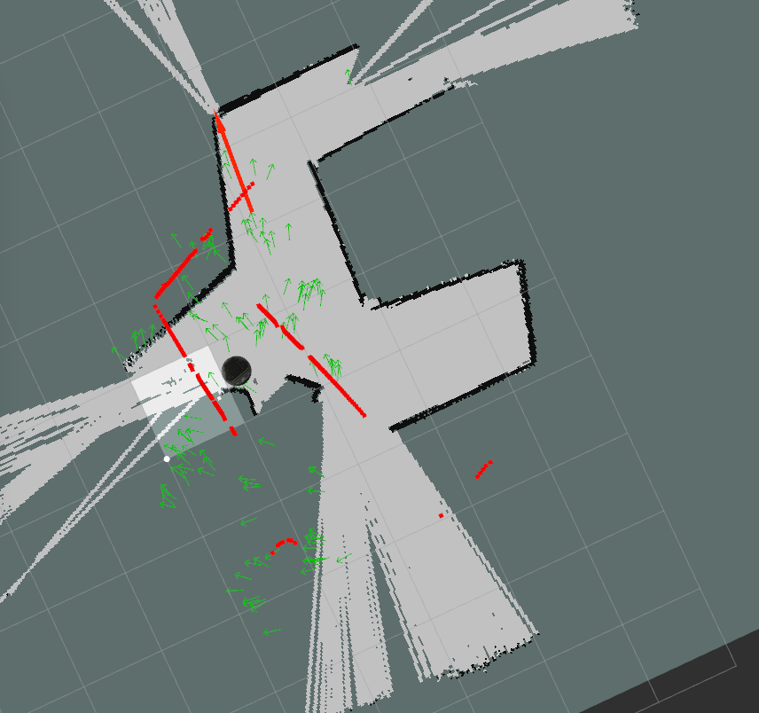
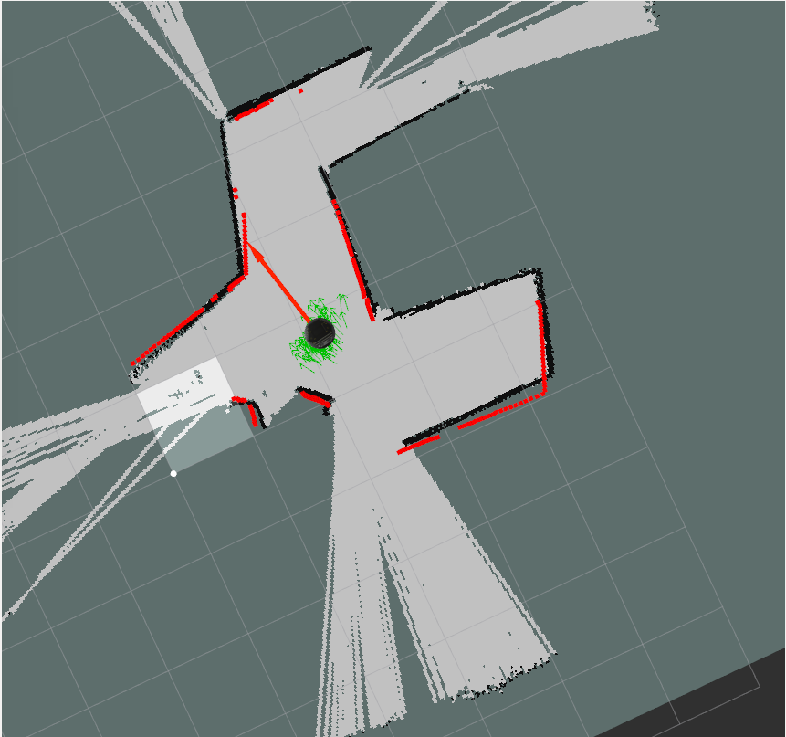

# robot_localization_2017
This is Claire Beery and Paul Krusell's repo for the robot  localization assignment in CompRobo, spring 2017.

<h3>Goal</h3>

For this project, we had to create a robot localization module that uses particle filtering to determine the location of our robot given a map. 

<h3>Process</h3>
To start, we set up the map server client to allow use to pull in maps for testing our particle filter. This is was first created in a separate file then moved into the main pf.py file when testing showed the client to be working.  Next we initialized the particle cloud. This involved taking the message from the rvis 2d pose topic as the mean for a gaussian distribution of particles. The spread of the distribution was set by a single sigma for both orientation and position.  This value was determined by trial and error such as to create a distribution that was approximately four to five times larger that the size of the robot while still having the orientation of the particle facing within have a circle of each over. 

Next we set up three robot pose update options - the mean of the particles’ poses, the weighted mean of the particles’ poses, and the mode of the particles’ poses.  The last was originally made to create a list of particles with the same weight to in case of separate, equally-likely nodes developing in particle filter. By printing the number of such nodes, we could determine if the closest node to the last pose could be reasonably determined by brute force. Though we never went that route, we did find the mode list useful as we determined that all particle were getting weight equally even after the implementation of the laser scan weighting updates. This allowed us to determine there was a major bug in our weighting code later in the project. For most of testing, we used the weight mean in order to observe the particle behavior.  We realized that the when we used the mode to calculate the robot position, the location would bounce around frequently, leading to uncertainty. We used the unweighted mean sparingly as it didn’t place any emphasis on the weight of the particles, which didn’t seem optimal as they are weighted for a reason. in the end, we settled on using the highest-weighted particle as it was eventually the most accurate reading. It’s also less susceptible to odom noise causing it to fluctuate than the weighted mean.

After implementing the robot pose update, we began updating the particle positions due to the motion of the robot. We initially did not include noise in the odom motion update to allow for testing if motion was correct. We spent a lot of time understanding and correctly calculating the positions of the particles after we updated them. At first we simply were just adding the new angle and distance to the old angle and distance, but realized that that didn’t take into account the correct changes in direction, and modified our code so that we added each change in direction or distance in the correct order. Namely, we changed the code to have each particle rotated toward the delta change in translation then move in that direction along the displacement of the translation delta, and finish by rotating the remating rotation deltat not account for by the rotation to the translation displacement direction.  

We had a similar problem in our laser scan weighting function.  The direction the scan being set as relative to the odom frame and not accounting for the rotation of the particle. This cause the expected location of objects according to the particle to be incorrect due to calculation errors instead of particle location error. This was later fixed to declare the scan directions in odom to be set by the orientation of the particle and the direction of the scan relative to the particle. 

After the particle transformations had been fixed, noise was added to the odom update. This involved sampling from a gaussian distribution for changes in translation and second rotation of the particles. The translation and rotation motion distributions have different sigma (spread) parameter to allow for separate tuning of the values.

The weighting code was completed in two phases. The first was weighting the particles simply on the result of the forward facing laser scan. Particle resampling was implemented at the same time in our process by calling the random draw helper function using the list of particles and a list of their weights. The weighting code looked at the location that the particle expected to see an obstacle in in the map frame if the laser scan had originated from that particle.  It then compared this location to nearby obstacles in the map using the closest neighbor helper function provided.  The produced error distance of the expected obstacle location to closest obstacle location was given a likelihood based on a gaussian distribution around zero error with a spread of the expected error of the laser scan. This likelihood weight was calculated for all particles and then normalized. By using just the forward scan direction, we were able to teleop a simulation of the robot in the Gazebo neato_playground forward and back in front of a wall and verify that the particles converged to a line parallel to the wall, moving with the robot.   

Finally implemented weighting based on all the laser scan range. This involved updating the expected obstacle locations given by the laser scan values to take into account the direction of the laser scan not just the particle. No return scans were discarded.  Additionally the cubed likelihood given at each scan direction per particle was summed. Cubing the likelihoods cause low likelihood values to be squashed. This makes the system look for the “most good” particle instead of the “least bad” particle.  It would be too easy to disregard an accurate particle based on one or two bad laser readings caused by noise or only slight misalignment with a wall’s corner. Squashing bad values makes this problem go away while keeping good values. Originally we forgot to set the calculated summed likelihood to the weight of the particle. 

The result was particles persisted even when in clearly incorrect locations of the map. Luckily a combination of rubber ducking with a NINJA and rereading and writing out code process for comprehension allowed this error to be discovered. 

The bag files for the filter in action can be found [here](my_localizer/bags) . These bags are suffixed with \_filtered.

<h3>Possible Future Improvements</h3>
If we had more time, we would work on tuning the parameters for weighting and odom motion noise. We would especially look at what happens as the robot turns corners, because it’s at its most inaccurate as it goes around bends. We would have also liked to make our own map and bag files, as it seems very interesting.

<h3>Lessons Learned</h3>
We found that it is very helpful to pair program as well as “rubber-ducking” while coding, as it helps us work through our logic as we code. We also found that using a lot of small functions with known inputs and outputs was nice as we could focus on one small section and can test functions separately. Another important lesson we learned is that we work best with frequent but short (1-2 hr) meetings so that we don’t get bogged down hitting our heads against code or logic. Finally, we found that using the whiteboards in ac109 to write our logic and code is useful as it gives us a chance to improve our understanding and identify issues.
